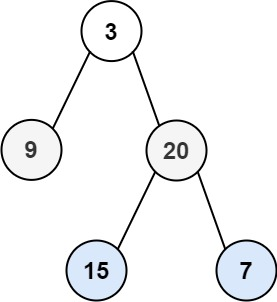
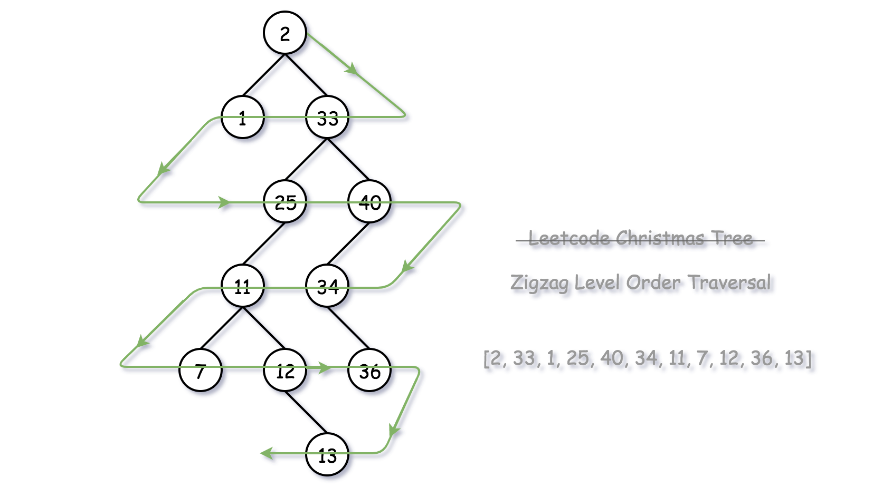

# Binary Tree Zigzag Level Order Traversal

Given the `root` of a binary tree, return the zigzag level order traversal of its nodes' values. (i.e., from left to right, then right to left for the next level and alternate between).

Example 1:



```
Input: root = [3,9,20,null,null,15,7]
Output: [[3],[20,9],[15,7]]
```

Example 2:

```
Input: root = [1]
Output: [[1]]
```

Example 3:

```
Input: root = []
Output: []
```

## Approach 1: BFS (Breadth-First Search)

### Intuition

Following the description of the problem, the most intuitive solution would be the BFS (Breadth-First Search) approach through which we traverse the tree level-by-level.

The default ordering of BFS within a single level is from left to right. As a result, we should adjust the BFS algorithm a bit to generate the desired zigzag ordering.

> One of the keys here is to store the values that are of the same level with the deque (double-ended queue) data structure, where we could add new values on either end of a queue.

So if we want to have the ordering of FIFO (first-in-first-out), we simply append the new elements to the tail of the queue, i.e. the late comers stand last in the queue. While if we want to have the ordering of FILO (first-in-last-out), we insert the new elements to the head of the queue, i.e. the late comers jump the queue.



### Algorithm

There are several ways to implement the BFS algorithm.

One way would be that we run a two-level nested loop, with the outer loop iterating each level on the tree, and with the inner loop iterating each node within a single level.
We could also implement BFS with a single loop though. The trick is that we append the nodes to be visited into a queue and we separate nodes of different levels with a sort of delimiter (e.g. an empty node). The delimiter marks the end of a level, as well as the beginning of a new level.

### Solution

```java
/**
 * Definition for a binary tree node.
 * public class TreeNode {
 *     int val;
 *     TreeNode left;
 *     TreeNode right;
 *     TreeNode() {}
 *     TreeNode(int val) { this.val = val; }
 *     TreeNode(int val, TreeNode left, TreeNode right) {
 *         this.val = val;
 *         this.left = left;
 *         this.right = right;
 *     }
 * }
 */
class Solution {
    public List<List<Integer>> zigzagLevelOrder(TreeNode root) {
           List<List<Integer>> ans = new ArrayList<>();

        if(root == null) return ans;

        LinkedList<TreeNode> q = new LinkedList<>();

        q.offer(root);
        q.offer(null);
        boolean orderLeft = true;

        LinkedList<Integer> list = new LinkedList<>();

        while(!q.isEmpty()){

            TreeNode cur = q.pollFirst();
            if(cur != null){
                if(orderLeft){
                    list.addLast(cur.val);
                } else{
                    list.addFirst(cur.val);
                }

                if(cur.left != null) q.offer(cur.left);

                if(cur.right != null) q.offer(cur.right);
            } else{
                // we finish the scan of one level
                ans.add(list);
                list = new LinkedList<>();
                if(q.size() > 0)
                    q.offer(null);
                orderLeft = !orderLeft;
            }

        }

        return ans;

    }
}
```

### Complexity Analysis

Time Complexity : `O(n)`

Space Complexity: `O(n)`
